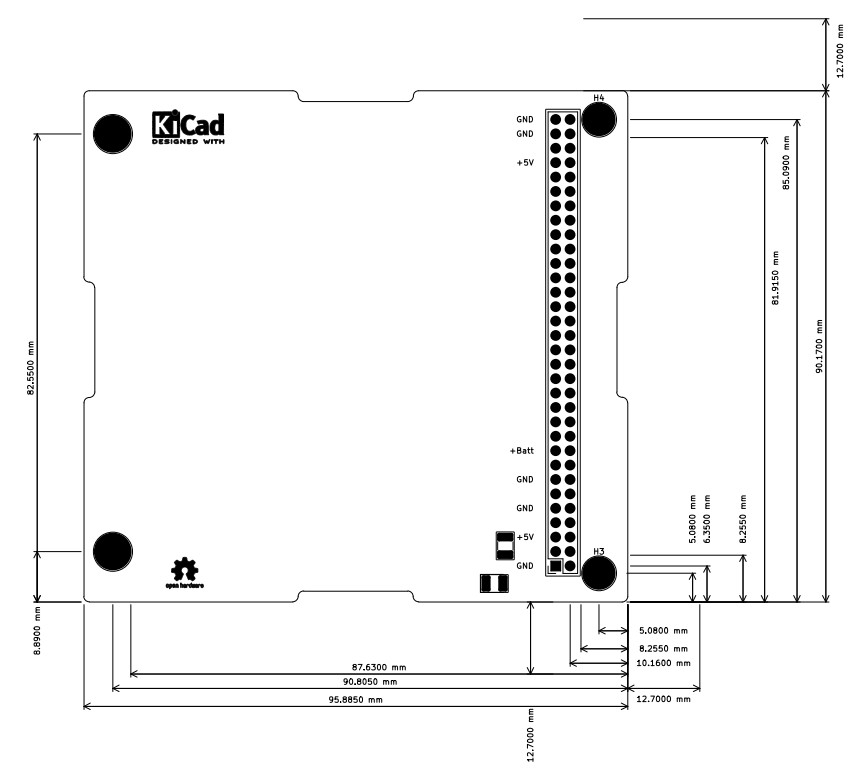
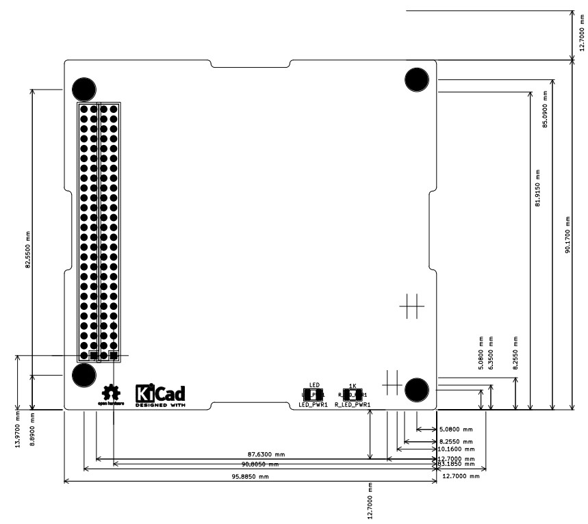
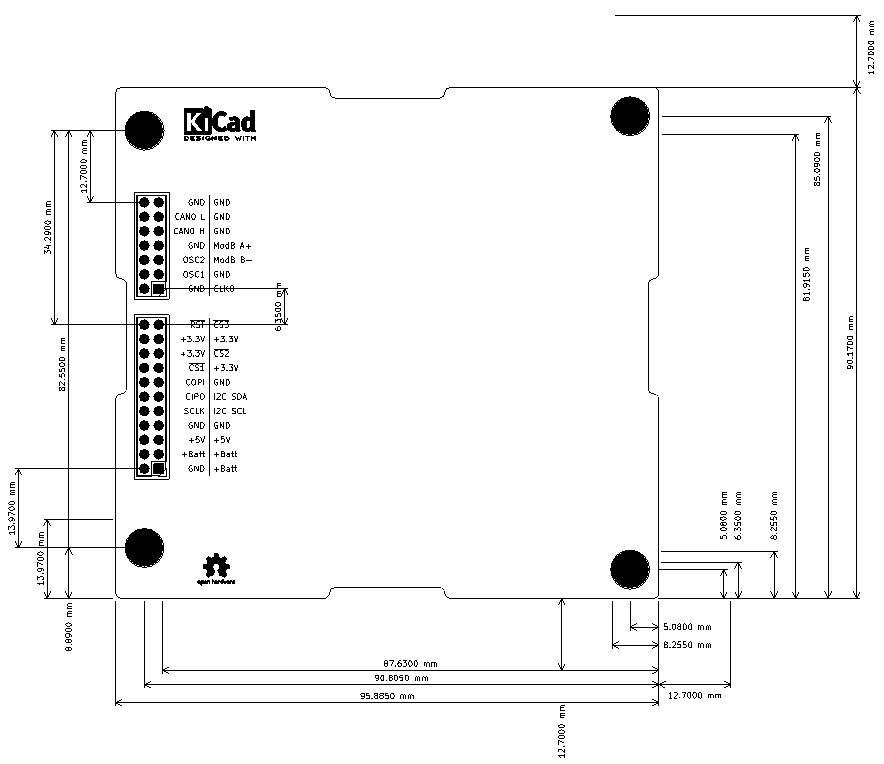

# PC104 template PCB

PC104 form factor compliant with the PC104_Spec_v2_6

## PC104 ISA 8bits

---
## PC104 ISA 16bits

---
## PC104 LibreCube

---
## PC104 "PCI CAN Express"
Custom connector designed from the PCI-Express(x1) pin-out

	Liaison :
	 - PRSNT1# et PRSNT2# par le GNDD (équivalent présence carte PCIx1)
	
	Remplacement :
	 - SMBus -> I2C
	 - JTAG -> SPI dont SC1# et SC2#
	 - WAKE# -> CS3#
	 - CLKREQ -> CLKO
	 - RefClk différentielle PCI -> OSC1 et OSC2 pour external clock MCU
	 - HSOp(0) soit TX0 PCI -> ModBus A+
	 - HSOn(0) soit TX0 PCI -> ModBus B-
	 - HSIp(0) soit RXO PCI -> CAN_0_H
	 - HSIn(0) soit RXO PCI -> CAN_0_L
	
	PS : 
	L'utilisation d'un RS485 4 fils est possibles en cablant :
	 - HSOp(0) soit TX0 PCI -> DI_A+ master / RO_A+ slave(s)
	 - HSOn(0) soit TX0 PCI -> DI_B- master / RO_B- slave(s)
	 - HSIp(0) soit RXO PCI -> RO_A+ master / DI_A+ slave(s)
	 - HSIn(0) soit RXO PCI -> RO_B- master / DI_B- slave(s)

	L'utilisation d'un RS485 2 fils est possibles en cablant :
	 - HSOp(0) soit TX0 PCI -> A+ master / A+ slave
	 - HSOn(0) soit TX0 PCI -> B- master / B- slave
	 - HSIp(0) soit RXO PCI -> NC. ou CAN_0_H
	 - HSIn(0) soit RXO PCI -> NC. ou CAN_0_L

---
